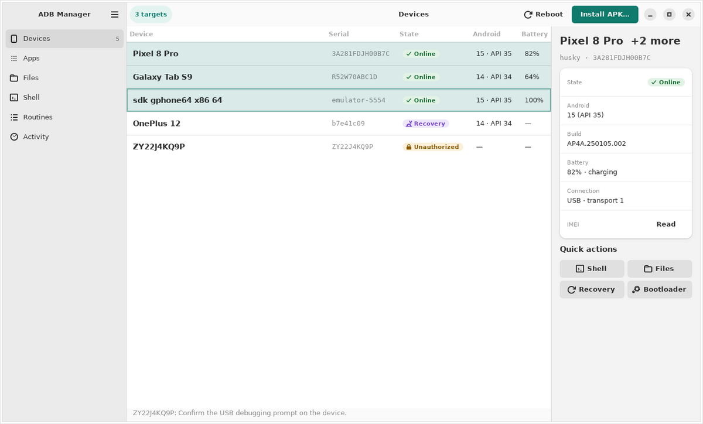
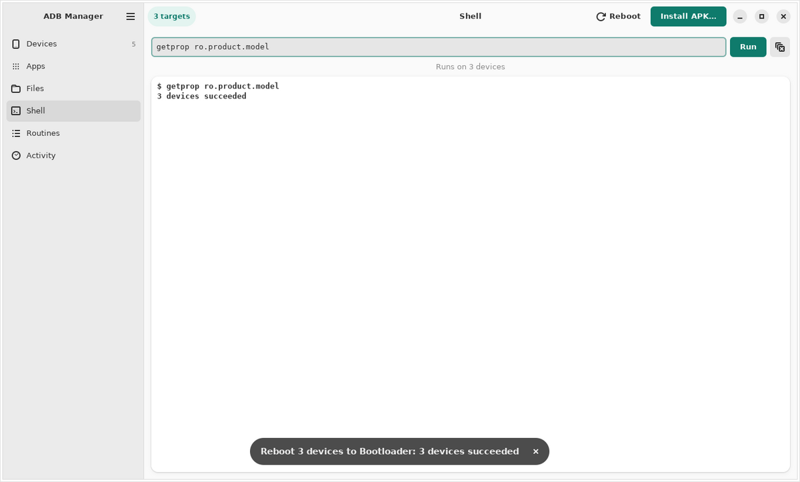
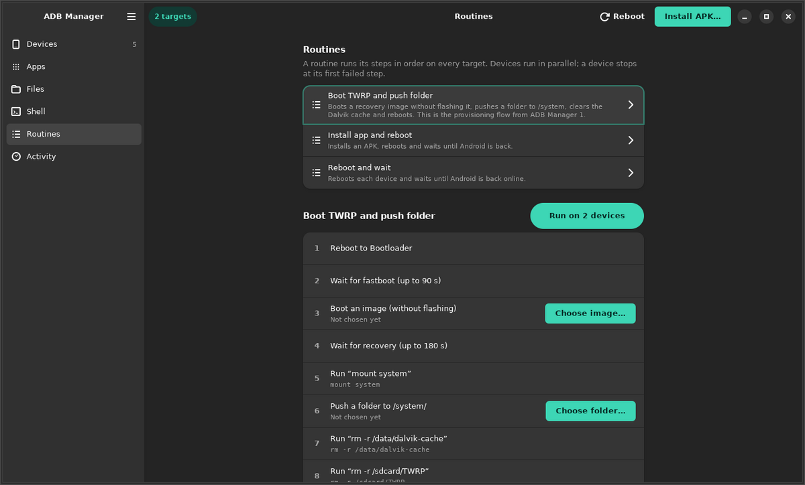

# ADB Manager

A desktop companion for Android devices on **macOS, Windows and Linux**.
Plug in one device or twenty and act on all of them at once:
- install and uninstall apps
- reboot into any mode
- run shell commands
- move files
- boot images with fastboot
- run multi-step routines



## How it is built

One fast core, three native apps:

| Layer | Technology |
|---|---|
| Core | Rust (`crates/adbm-core`). It speaks the adb host protocol natively and drives `fastboot`. It also reads APK manifests and runs every action as a cancellable job across devices in parallel. |
| C ABI | `crates/adbm-ffi`: seven functions, JSON in and out (`include/adbm.h`). |
| macOS | SwiftUI (`apps/macos`, Swift package) that links the core as a static library. |
| Windows | WinUI 3, unpackaged (`apps/windows`), calling the core through P/Invoke. |
| Linux | GTK 4 + libadwaita (`apps/linux`), using the core directly from Rust. |

All three apps share one design language: [`design/DESIGN.md`](design/DESIGN.md),
[`design/tokens.json`](design/tokens.json), [`design/icons.md`](design/icons.md),
and the mockup [`design/mockup.html`](design/mockup.html). The reviewed plan
and its trade-offs are in [`docs/PLAN.md`](docs/PLAN.md).

## Requirements

Android **platform-tools** (`adb`, `fastboot`) must be installed. The app finds
them in `PATH`, `ANDROID_HOME` or the default SDK folder, and you can also set
their paths in Settings. They are not bundled.

## Building

Every platform needs the Rust core first (Rust 1.85 or newer).

### Linux

```sh
sudo apt install libgtk-4-dev libadwaita-1-dev   # GTK ≥ 4.14, libadwaita ≥ 1.5
cargo run -p adbm-gtk --release
```

### macOS (14 or later, Xcode 16)

```sh
cargo build -p adbm-ffi --release
mkdir -p apps/macos/lib && cp target/release/libadbm_ffi.a apps/macos/lib/
cd apps/macos && swift build -c release -Xlinker -L"$PWD/lib" && swift run -Xlinker -L"$PWD/lib"
```

### Windows (10 1809 or later, .NET 8 SDK)

```powershell
cargo build -p adbm-ffi --release
dotnet run --project apps/windows/AdbManager -r win-x64 -p:Platform=x64 -p:AdbmFfiDll="$PWD\target\release\adbm_ffi.dll"
```

## Working without devices

A fake adb server with sample devices speaks the real protocol:

```sh
cargo run -p adbm-core --features test-support --example fake_adb -- 5199
ADBM_ADB_PORT=5199 cargo run -p adbm-gtk      # Linux app against it
```

## Tests

```sh
cargo test --workspace --features adbm-core/test-support   # core, protocol, FFI contract
scripts/check-bridges.sh    # Swift and C# bridges against the real core (needs swiftc / dotnet)
ADBM_REAL_ADB=1 cargo test -p adbm-core --test real_adb     # against a real adb server
```

## Verification status

| Part | How it has been verified |
|---|---|
| Core, FFI | Unit tests and integration tests against the fake adb server. A smoke test against a real adb server. A C program using only `adbm.h`. |
| Linux app | Built, and run under Xvfb against the fake server: devices, targets, shell, files, routines, activity, dark mode. |
| macOS app | The bridge and models were compiled and **run** against the core on Linux (`scripts/check-bridges.sh`), and every SwiftUI file parses. The SwiftUI build itself runs only in CI on macOS. **It has not been run on a Mac.** |
| Windows app | The UI-independent layer was built and **run** against the core on Linux. The WinUI app type-checks on Linux, and the full build runs in CI on Windows. **It has not been run on Windows.** |

None of the apps has been tested with physical devices yet.

## Screenshots (Linux)

| Shell on three devices | Routines (dark) |
|---|---|
|  |  |

## License

Apache-2.0. See [LICENSE](LICENSE).
